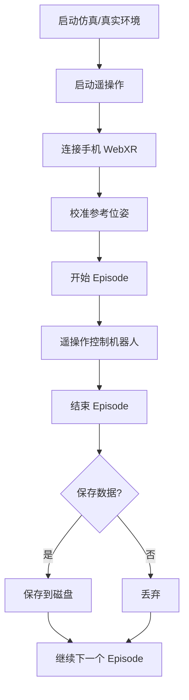
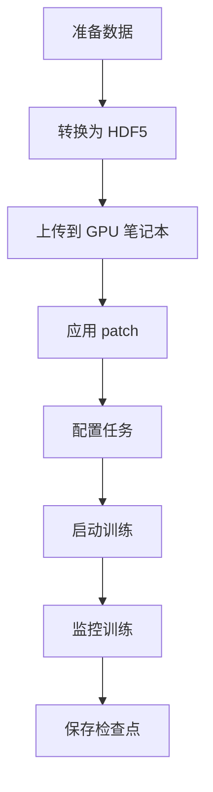
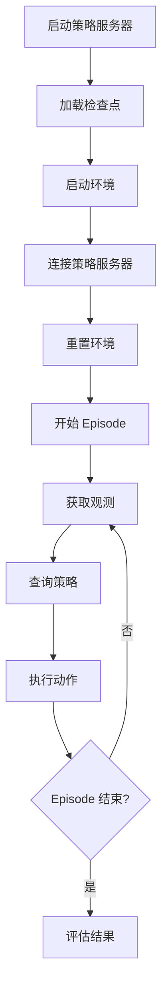

# TidyBot2 项目学习指南

## 目录

1. [项目概述](#项目概述)
2. [系统架构](#系统架构)
3. [核心模块详解](#核心模块详解)
4. [开发流程](#开发流程)
5. [代码结构](#代码结构)
6. [常见问题](#常见问题)

---

## 项目概述

### 什么是 TidyBot2？

TidyBot++ 是一个开源的全向移动机械臂机器人平台，专为机器人学习而设计。该项目于 2024 年在 CoRL（Conference on Robot Learning）会议上发表。

**核心特性：**
- ✅ **全向移动底盘**：使用动力脚轮，可独立控制平面内所有自由度
- ✅ **灵活的机械臂支持**：支持多种机械臂（如 Kinova Gen3、Franka、ARX5）
- ✅ **手机遥操作接口**：通过 WebXR 实现直观的数据采集
- ✅ **模仿学习支持**：完整的策略训练和推理流程
- ✅ **仿真环境**：基于 MuJoCo 的仿真环境，支持完整的学习流程

**适用场景：**
- 家庭服务机器人任务
- 移动操作研究
- 机器人学习数据收集
- 模仿学习研究

---

## 系统架构

### 整体架构图

```
┌─────────────────┐     ┌─────────────────┐     ┌─────────────────┐
│   手机端        │     │   GPU 笔记本    │     │   开发机        │
│   (WebXR)       │     │   (策略训练)    │     │   (数据处理)    │
│                 │     │                 │     │                 │
│  - 遥操作控制   │     │  - diffusion    │     │  - 数据转换     │
│  - 实时反馈     │────▶│    policy       │◀────│  - 可视化       │
└─────────────────┘     │  - 策略推理     │     │  - 仿真测试     │
                        └─────────────────┘     └─────────────────┘
                                │                        │
                                │  5555 (策略服务)       │
                                └────────────────────────┘
                                          │
                                          ▼
                        ┌─────────────────────────────┐
                        │     机器人端 (Mini PC)      │
                        │                             │
                        │  ┌────────────────────────┐ │
                        │  │   base_server.py       │ │
                        │  │   (50000 端口)         │ │
                        │  │   - 底盘实时控制       │ │
                        │  └────────────────────────┘ │
                        │                             │
                        │  ┌────────────────────────┐ │
                        │  │   arm_server.py        │ │
                        │  │   (50001 端口)         │ │
                        │  │   - 机械臂实时控制     │ │
                        │  └────────────────────────┘ │
                        │                             │
                        │  ┌────────────────────────┐ │
                        │  │   相机系统             │ │
                        │  │   - 底盘相机           │ │
                        │  │   - 腕部相机           │ │
                        │  └────────────────────────┘ │
                        └─────────────────────────────┘
                                    │
                                    ▼
                        ┌─────────────────────────────┐
                        │   硬件层                    │
                        │                             │
                        │  - 4 个动力脚轮             │
                        │  - Kinova Gen3 机械臂       │
                        │  - Robotiq 2F-85 夹爪       │
                        │  - Logitech C930e 相机      │
                        └─────────────────────────────┘
```

### 数据流图

```
遥操作模式:
手机 → WebXR → Flask/SocketIO → TeleopPolicy → 环境 → 机器人

策略推理模式:
相机 → 观测 → RemotePolicy → ZMQ → 策略服务器 → Diffusion Policy → 动作 → 机器人
```

### 控制频率

- **策略控制频率**: 10 Hz (100ms)
- **底盘控制频率**: 250 Hz (4ms)
- **机械臂控制频率**: 1000 Hz (1ms)
- **相机采集频率**: 30 fps

---

## 核心模块详解

### 1. 主程序 (main.py)

**功能**: 主程序入口，协调遥操作和策略推理

**核心函数**:
- `run_episode()`: 运行一个完整的 episode
  - 重置环境
  - 等待用户开始
  - 执行动作循环
  - 保存数据
- `should_save_episode()`: 询问用户是否保存 episode
- `main()`: 创建环境和策略，进入主循环

**使用场景**:
```bash
# 仿真环境 + 遥操作 + 保存数据
python main.py --sim --teleop --save

# 真实机器人 + 策略推理
python main.py
```

---

### 2. 移动底盘控制器 (base_controller.py)

**功能**: 实现全向移动底盘的实时控制

**核心概念**:
- **动力脚轮 (Powered Caster)**: 每个脚轮有 2 个电机（转向电机 + 驱动电机）
- **4 个脚轮配置**: 独立控制，实现全向移动
- **实时控制**: 250 Hz 控制频率，确保平滑运动

**关键类**:

1. **`Motor` 类**
   - 封装 TalonFX 电机控制
   - 支持 FOC（Field-Oriented Control）
   - 电流限制保护

2. **`Caster` 类**
   - 管理单个脚轮（2 个电机）
   - 转向角度控制
   - 驱动速度控制
   - 运动学计算

3. **`Vehicle` 类**
   - 管理 4 个脚轮
   - 全局/局部坐标系速度控制
   - 位置控制（含 PID + 在线轨迹生成）
   - 里程计估计

**控制模式**:
```python
# 速度控制（局部坐标系）
vehicle.set_target_velocity(np.array([vx, vy, omega]))

# 位置控制（全局坐标系）
vehicle.set_target_position(np.array([x, y, theta]))
```

**安全注意事项**:
- ⚠️ 电机功率强大，测试时请小心
- ⚠️ 建议先将底盘侧放（脚轮离地）测试
- ⚠️ 使用电流限制保护
- ⚠️ 建议添加急停按钮和碰撞传感器

---

### 3. 机械臂控制器 (arm_controller.py)

**功能**: 实现 Kinova Gen3 机械臂的柔顺控制

**核心算法**: 关节空间柔顺控制器（Joint Space Compliant Controller）

**参考文献**: 
- EmPRISE Lab 的开源柔顺控制器
- [控制器公式文档](https://github.com/empriselab/gen3_compliant_controllers/blob/main/media/controller_formulation.pdf)

**关键类**:

1. **`JointCompliantController` 类**
   - 输入: 期望关节位置 (qpos) 和夹爪位置
   - 输出: 关节力矩命令 (tau_c)
   - 特性:
     - 在线轨迹生成 (OTG) - 平滑运动
     - 低通滤波 - 减少传感器噪声
     - 重力补偿
     - 摩擦补偿
     - 虚拟电机模型

2. **核心控制增益**:
```python
K_r = 反射惯量矩阵  # 虚拟电机惯量
K_l = 摩擦增益
K_p = 位置增益
K_d = 速度增益
```

**控制流程**:
```
关节位置指令 → OTG平滑 → 控制器计算 → 力矩指令 → 电机执行
              ↑                    ↑
              └─────反馈延迟处理───┘
```

**辅助函数**:
- `command_loop_retract()`: 保持机械臂收回姿态
- `command_loop_circle()`: 执行圆形轨迹运动

---

### 4. Kinova 低级接口 (kinova.py)

**功能**: Kinova Gen3 机械臂的底层通信和控制

**核心类**: `TorqueControlledArm`

**主要功能**:
1. **连接管理**
   - TCP 连接（高级指令）
   - UDP 连接（实时循环控制）
   - 检查机械臂连接状态

2. **控制模式**
   - 高级模式：使用内置控制器
     - `home()`: 回到 Home 姿态
     - `retract()`: 收回姿态
     - `open_gripper()`: 打开夹爪
     - `close_gripper()`: 关闭夹爪
   
   - 低级模式：力矩控制循环
     - `init_cyclic()`: 启动循环控制
     - `stop_cyclic()`: 停止循环控制
     - 1000 Hz 控制频率

3. **运动学**
   - 使用 Pinocchio 库
   - 正运动学：关节角度 → 末端位姿
   - 逆运动学求解

4. **安全特性**
   - 单实例保护（PID 文件）
   - 电流限制
   - 力矩限制

**重要转换**:
```python
# 力矩转换为电流（Kinova 的力矩控制器不准确）
current = torque / torque_constant
current = np.clip(current, current_limit_min, current_limit_max)
```

---

### 5. 策略模块 (policies.py)

**功能**: 定义策略接口和实现

**策略类型**:

#### 5.1 TeleopPolicy（遥操作策略）
- 通过手机 WebXR 接收遥操作指令
- Flask + SocketIO 实现 Web 服务器
- 支持双手控制（主手控制臂/底盘，副手控制底盘）

**核心流程**:
```
手机 WebXR → WebSocket → TeleopController → 动作指令
              ↓
         实时位姿转换
```

**关键功能**:
- 坐标系转换：WebXR 坐标系 → 机器人坐标系
- 设备校准：记录参考位姿
- 夹爪控制：通过触发器
- 启用开关：安全控制

#### 5.2 RemotePolicy（远程策略）
- 连接到远程策略服务器（ZMQ）
- 发送观测，接收动作
- 使用手机作为启用设备

**通信流程**:
```
观测（图像+状态）→ ZMQ → 策略服务器 → Diffusion Policy → 动作 → ZMQ → 客户端
```

---

### 6. 环境模块

#### 6.1 MujocoEnv（仿真环境）

**功能**: 基于 MuJoCo 的仿真环境

**特点**:
- 多进程架构：控制器和渲染器在独立进程中
- 共享内存通信：高效的进程间数据传输
- 实时可视化：可选的 MuJoCo viewer

**核心组件**:
- `BaseController`: 底盘位置控制
- `ArmController`: 机械臂 IK 控制
- `Renderer`: 离屏渲染相机图像

#### 6.2 RealEnv（真实环境）

**功能**: 真实机器人接口

**特点**:
- RPC 连接到 base_server 和 arm_server
- 封装底盘、机械臂、相机接口
- 与仿真环境保持一致的 API

**核心方法**:
```python
obs = env.get_obs()      # 获取观测
env.reset()              # 重置机器人
env.step(action)         # 执行动作
env.close()              # 关闭连接
```

---

### 7. 相机模块 (cameras.py)

**支持的相机**:

#### 7.1 LogitechCamera
- 型号：C930e
- 分辨率：640x360
- 格式：MJPEG
- 特殊设置：
  - 禁用自动对焦
  - 缓冲区大小=1（降低延迟）
  - 固定焦距

#### 7.2 KinovaCamera
- 内置于 Kinova Gen3
- 分辨率：640x480
- 使用 GStreamer 读取
- 需要特殊的 OpenCV 构建

**设计模式**:
- 后台线程持续采集（30 fps）
- `get_image()` 返回最新图像
- 避免阻塞主线程

---

### 8. 数据存储模块 (episode_storage.py)

**功能**: Episode 数据的保存和加载

#### 8.1 EpisodeWriter
- 实时记录观测和动作
- 图像保存为 MP4 视频（节省空间）
- 状态数据保存为 pickle 文件
- 异步写入磁盘（避免阻塞）

**数据格式**:
```
data/demos/
  └── 20241008T123456789/
      ├── data.pkl           # 状态和动作
      ├── base_image.mp4     # 底盘相机视频
      └── wrist_image.mp4    # 腕部相机视频
```

#### 8.2 EpisodeReader
- 加载 episode 数据
- 自动从 MP4 恢复图像
- 支持仿真和真实数据互相重放

---

### 9. RPC 服务器

#### 9.1 base_server.py
- 端口：50000
- 功能：运行底盘控制器为独立的实时进程
- 方法：
  - `reset()`: 重置底盘位姿
  - `execute_action()`: 执行动作
  - `get_state()`: 获取状态
  - `close()`: 关闭连接

#### 9.2 arm_server.py
- 端口：50001
- 功能：运行机械臂控制器为独立的实时进程
- 方法：同 base_server

**为什么需要 RPC 服务器？**
- ✅ 隔离实时进程和非实时进程
- ✅ 避免 Python 导入延迟影响实时性
- ✅ 避免 GIL（全局解释器锁）干扰
- ✅ 提高系统稳定性

---

### 10. 策略服务器 (policy_server.py)

**功能**: 在 GPU 笔记本上运行策略推理

**关键特性**:

#### 10.1 PolicyWrapper
- 延迟隐藏：提前 200ms 开始推理
- 动作序列缓存：避免等待推理完成
- 并行推理：充分利用 GPU

**延迟隐藏原理**:
```
时间线:
0ms    100ms   200ms   300ms
|------|------|------|------|
执行A0  执行A1  执行A2  执行A3
  ↓
开始推理A2-A9
        ↓
        推理完成（115ms后）
                ↓
                A2-A9可用
```

#### 10.2 ZMQ 服务器
- 端口：5555
- 协议：REQ-REP
- 数据格式：PyObject（通过 pickle）

**通信协议**:
```python
# 客户端发送
{'reset': True} 或 {'obs': observation_dict}

# 服务器返回
action_dict
```

---

## 开发流程

### 1. 数据收集流程



**详细步骤**:

1. **启动仿真环境**:
```bash
python main.py --sim --teleop --save --output-dir data/my_task
```

2. **连接手机**:
   - 确保手机和电脑在同一 WiFi
   - 访问 `http://<ip>:5000`
   - 点击 "Start AR"

3. **数据收集**:
   - 点击 "Start episode"
   - 使用手机遥操作机器人
   - 完成任务后点击 "End episode"
   - 选择是否保存

4. **验证数据**:
```bash
python replay_episodes.py --sim --input-dir data/my_task --show-images
```

---

### 2. 策略训练流程



**详细步骤**:

1. **转换数据格式**:
```bash
python convert_to_robomimic_hdf5.py \
    --input-dir data/my_task \
    --output-path data/my_task.hdf5
```

2. **传输到 GPU 笔记本**:
```bash
scp data/my_task.hdf5 gpu-laptop:~/diffusion_policy/data/
```

3. **应用 patch**（首次）:
```bash
cd ~/diffusion_policy
git checkout 548a52b
git apply diffusion-policy.patch
```

4. **配置任务**:
编辑 `diffusion_policy/config/task/square_image_abs.yaml`:
```yaml
name: my_task
```

5. **启动训练**:
```bash
cd ~/diffusion_policy
mamba activate robodiff
python train.py --config-name=train_diffusion_unet_real_hybrid_workspace
```

6. **训练监控**:
- 查看终端输出
- 使用 TensorBoard（如果配置）
- 训练时间：约 500 epochs（取决于数据量）

---

### 3. 策略推理流程



**详细步骤**:

1. **启动策略服务器**（GPU 笔记本）:
```bash
cd ~/diffusion_policy
mamba activate robodiff
python policy_server.py --ckpt-path <path_to_checkpoint>
```

2. **建立 SSH 隧道**（客户端机器）:
```bash
ssh -L 5555:localhost:5555 gpu-laptop
```

3. **运行策略推理**（仿真）:
```bash
python main.py --sim
```

4. **运行策略推理**（真实机器人）:
```bash
# 在 mini PC 上
# 终端 1
python base_server.py

# 终端 2
python arm_server.py

# 终端 3
python main.py
```

---

### 4. 调试流程

#### 4.1 底盘调试

**查看底盘状态**:
```python
from base_controller import Vehicle
vehicle = Vehicle()
vehicle.start_control()
print(f'Position: {vehicle.x}')
print(f'Velocity: {vehicle.dx}')
```

**状态可视化**:
```bash
# 在 mini PC 上
python gamepad_teleop.py

# 在开发机上
ssh -L 6379:localhost:6379 minipc
python plot_base_state.py
```

#### 4.2 机械臂调试

**重力补偿测试**:
```python
from kinova import TorqueControlledArm, grav_comp_control_callback
arm = TorqueControlledArm()
arm.init_cyclic(grav_comp_control_callback)
# 轻推机械臂，应该能自由移动
```

**关节柔顺控制测试**:
```bash
python arm_controller.py
# 机械臂应保持在 retract 姿态
# 轻推应有柔顺感
```

#### 4.3 相机调试

**测试底盘相机**:
```python
from cameras import LogitechCamera
from constants import BASE_CAMERA_SERIAL
import cv2 as cv

camera = LogitechCamera(BASE_CAMERA_SERIAL)
image = camera.get_image()
while image is None:
    image = camera.get_image()
cv.imwrite('test.jpg', cv.cvtColor(image, cv.COLOR_RGB2BGR))
```

**测试腕部相机**:
```python
from cameras import KinovaCamera
camera = KinovaCamera()
image = camera.get_image()
while image is None:
    image = camera.get_image()
cv.imwrite('test.jpg', cv.cvtColor(image, cv.COLOR_RGB2BGR))
```

---

## 代码结构

```
tidybot2/
├── main.py                          # 主程序入口
├── constants.py                     # 全局常量配置
├── utils.py                         # 工具函数
│
├── 底盘相关
│   ├── base_controller.py           # 底盘控制器
│   ├── base_server.py               # 底盘 RPC 服务器
│   └── gamepad_teleop.py            # 手柄遥操作
│
├── 机械臂相关
│   ├── kinova.py                    # Kinova 低级接口
│   ├── arm_controller.py            # 机械臂控制器
│   ├── arm_server.py                # 机械臂 RPC 服务器
│   └── ik_solver.py                 # 逆运动学求解器
│
├── 策略相关
│   ├── policies.py                  # 策略接口和实现
│   └── policy_server.py             # 策略服务器
│
├── 环境相关
│   ├── mujoco_env.py                # MuJoCo 仿真环境
│   ├── real_env.py                  # 真实机器人环境
│   └── cameras.py                   # 相机接口
│
├── 数据相关
│   ├── episode_storage.py           # Episode 存储
│   ├── replay_episodes.py           # 重放 episode
│   ├── convert_to_robomimic_hdf5.py # 数据格式转换
│   └── plot_demos.ipynb             # 数据可视化
│
├── 可视化相关
│   ├── plot_base_state.py           # 底盘状态可视化
│   └── templates/
│       └── index.html               # WebXR 界面
│
└── 模型文件
    └── models/
        ├── gen3_robotiq_2f_85.urdf  # 机械臂 URDF
        └── stanford_tidybot/        # MuJoCo 模型
```

---

## 常见问题

### Q1: 为什么需要 RPC 服务器？

**A**: 实时控制器需要以固定频率运行（底盘 250Hz，机械臂 1000Hz），不能有任何延迟抖动。如果直接在主进程中导入控制器：
- ❌ Python 的 `import cv2` 可能导致几百毫秒的延迟
- ❌ GIL 会干扰实时控制循环
- ❌ 垃圾回收可能导致不可预测的延迟

使用 RPC 服务器可以：
- ✅ 隔离实时进程，避免非实时代码干扰
- ✅ 设置实时优先级（`nice -20`）
- ✅ 提高系统稳定性

---

### Q2: 如何理解延迟隐藏（Latency Hiding）？

**A**: Diffusion Policy 的推理时间约 115ms，而动作执行周期是 100ms。如果每次都等待推理完成，会导致动作执行不连续。

**解决方案**：
- 策略一次输出 10 个动作（1 秒的动作序列）
- 提前 200ms 开始下一次推理
- 当前动作序列用完时，下一个序列已经准备好

**时间线示例**：
```
步骤   0    1    2    3    4    5    6    7    8    9    10   11
执行   A0   A1   A2   A3   A4   A5   A6   A7   A8   A9   A10  A11
推理   [-----推理 A0-A9-----]    [-----推理 A10-A19-----]
       0ms              115ms                    215ms
```

---

### Q3: 仿真和真实机器人的区别？

**A**: 
| 方面 | 仿真环境 | 真实机器人 |
|------|---------|-----------|
| 启动 | `python main.py --sim` | 需要先启动 `base_server.py` 和 `arm_server.py` |
| 控制 | 位置控制（IK） | 力矩控制（柔顺控制） |
| 相机 | 渲染图像 | 真实相机 |
| 物理 | MuJoCo 物理引擎 | 真实物理 |
| 安全 | 无危险 | 需要注意安全 |

**数据兼容性**：
- ✅ 数据格式完全一致
- ✅ 可以用仿真数据训练，真实机器人测试
- ✅ 可以混合仿真和真实数据训练

---

### Q4: 如何调整机械臂的柔顺性？

**A**: 修改 `arm_controller.py` 中的增益参数：

```python
# 增加柔顺性（更软）
K_p = np.diag([50.0, 50.0, 50.0, 50.0, 25.0, 25.0, 25.0])  # 降低 K_p
K_d = np.diag([1.5, 1.5, 1.5, 1.5, 1.0, 1.0, 1.0])        # 降低 K_d

# 降低柔顺性（更硬）
K_p = np.diag([200.0, 200.0, 200.0, 200.0, 100.0, 100.0, 100.0])  # 提高 K_p
K_d = np.diag([6.0, 6.0, 6.0, 6.0, 4.0, 4.0, 4.0])                # 提高 K_d
```

⚠️ **注意**: 改动参数后需要小心测试，避免震荡或不稳定。

---

### Q5: 底盘里程计不准怎么办？

**A**: 可能原因：
1. **编码器偏移未校准**：编辑 `constants.py` 中的 `ENCODER_MAGNET_OFFSETS`
2. **控制循环延迟**：检查 mini PC 的实时性能
3. **地面打滑**：确保地面摩擦力足够
4. **电池电压低**：检查电池电压（应 > 11.5V）

**校准方法**：
```python
# 1. 手动旋转每个脚轮，记录编码器读数
# 2. 计算偏移量
# 3. 更新 ENCODER_MAGNET_OFFSETS
```

---

### Q6: 相机延迟高怎么办？

**A**: 
1. **确保缓冲区大小为 1**：
```python
cap.set(cv.CAP_PROP_BUFFERSIZE, 1)
```

2. **使用 MJPEG 格式**（而不是原始格式）

3. **限制采集频率**：30 fps 已经足够

4. **Kinova 相机需要特殊的 OpenCV 构建**（支持 GStreamer）

---

### Q7: 如何添加新的机械臂？

**A**: 
1. 实现机械臂的低级接口（参考 `kinova.py`）
2. 实现控制器（参考 `arm_controller.py`）
3. 创建 RPC 服务器（参考 `arm_server.py`）
4. 更新 URDF 和 MuJoCo 模型
5. 调整控制增益

---

### Q8: 训练需要多少数据？

**A**: 
- **最少**: 50-100 个成功的 episodes
- **推荐**: 200-500 个 episodes
- **复杂任务**: 500-1000+ episodes

**数据质量比数量更重要**：
- ✅ 多样化的初始状态
- ✅ 平滑的轨迹
- ✅ 成功的任务完成
- ❌ 避免失败的 episodes

---

### Q9: GPU 笔记本的最低配置？

**A**: 
- **GPU**: RTX 3060 或更好（至少 6GB 显存）
- **内存**: 16GB 或更多
- **推理时间**: 
  - RTX 4080 Laptop: ~115ms
  - RTX 3060: ~200ms（需要调整 `LATENCY_BUDGET`）

---

### Q10: 如何贡献代码？

**A**: 
1. Fork 项目仓库
2. 创建功能分支
3. 提交 Pull Request
4. 确保代码通过测试
5. 添加文档和注释

**贡献方向**：
- 支持新的机械臂
- 改进控制算法
- 添加新的任务
- 优化性能
- 改进文档

---

## 学习资源

### 相关论文
1. [TidyBot++ 论文](http://tidybot2.github.io/paper.pdf)
2. [Diffusion Policy 论文](https://diffusion-policy.cs.columbia.edu)
3. [Powered Caster Vehicle 论文](https://github.com/google/powered-caster-vehicle)

### 代码参考
1. [Cornell EmPRISE Lab 柔顺控制器](https://github.com/empriselab/gen3_compliant_controllers)
2. [Google Powered Caster Vehicle](https://github.com/google/powered-caster-vehicle)
3. [Diffusion Policy 代码](https://github.com/real-stanford/diffusion_policy)

### 视频教程
- [项目演示视频](https://youtu.be/6MH7dhyIUdQ)
- [组装指南](http://tidybot2.github.io/docs)
- [使用指南](http://tidybot2.github.io/docs/usage)

---

## 下一步

根据您的目标选择：

1. **快速上手**：
   - 阅读 README.md
   - 运行仿真环境
   - 尝试遥操作

2. **数据收集**：
   - 设计任务
   - 收集演示数据
   - 验证数据质量

3. **策略训练**：
   - 转换数据格式
   - 配置训练参数
   - 启动训练

4. **系统开发**：
   - 深入理解各模块
   - 修改控制器
   - 添加新功能

---

## 联系方式

- **项目主页**: http://tidybot2.github.io
- **GitHub**: https://github.com/jimmyyhwu/tidybot2
- **问题反馈**: GitHub Issues
- **论文作者**: Jimmy Wu 等

---

**祝您学习愉快！** 🚀

